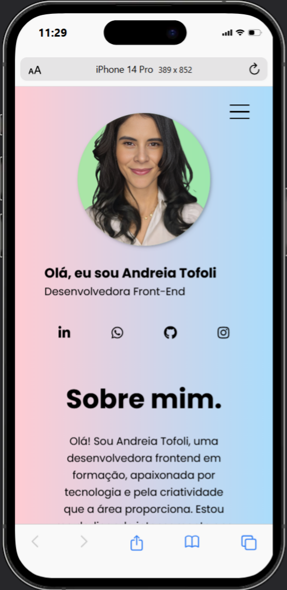

# Portfólio - Andreia Dias Tofoli

Este repositório apresenta meu portfólio, criado para demonstrar meus projetos e habilidades como desenvolvedora frontend em formação. O layout é responsivo e foi elaborado com foco em **HTML**, **CSS** e boas práticas de design.

## Objetivo
Construir um portfólio que destaque meus projetos, habilidades e trajetória, além de proporcionar uma interface responsiva e moderna.

## Exemplo do Projeto
Abaixo estão prévias de como o layout se adapta a diferentes dispositivos:

- **Versão Desktop**  
  

- **Versão Mobile**  
  

## Tecnologias Utilizadas
- **HTML5**: Estruturação do conteúdo.
- **CSS3**: Estilização e layout, com:
  - **Flexbox** e **Grid** para organização e responsividade.
  - **Media Queries** para adaptação em diferentes tamanhos de tela.
- **Google Fonts**: Tipografias modernas e limpas.
- **Font Awesome**: Ícones estilizados para redes sociais e outras funcionalidades.

## Estrutura do Projeto
- **`index.html`**: Página principal com estrutura do portfólio.
- **`src/css`**: Pasta com os arquivos de estilo:
  - `reset.css`: Normalização de estilos.
  - `variaveis.css`: Definição de cores e tamanhos reutilizáveis.
  - `global.css`: Estilos globais aplicados a todo o projeto.
  - `header.css`: Estilização do cabeçalho e navegação.
  - `apresentacao.css`: Layout da seção de apresentação.
  - `sobre-mim.css`: Estilização da seção sobre mim.
  - `habilidades.css`: Design das habilidades.
  - `meus-projetos.css`: Estilo da seção de projetos.
  - `footer.css`: Estilização do rodapé.
  - `responsivo.css`: Ajustes de estilo para diferentes tamanhos de tela.
- **`src/imagens`**: Contém imagens do projeto, como foto de perfil, capturas de tela dos projetos e ícones.

## Estrutura do Layout
### **Cabeçalho**
- Navegação com links âncora para as seções do portfólio.
- Menu hambúrguer responsivo.

### **Seção de Apresentação**
- Foto de perfil.
- Título e subtítulo que destacam minha formação e objetivos.
- Links para redes sociais.

### **Seção Sobre Mim**
- Texto descritivo sobre minha trajetória, interesses e metas.
- Botão para visualizar meu currículo.

### **Seção Habilidades**
- Destaque para minhas principais competências:
  - **HTML5**
  - **CSS3**
  - **GitHub**
  - **Git**

### **Seção Projetos**
- Carrossel interativo com links para os repositórios e descrições de projetos desenvolvidos.

### **Rodapé**
- Redes sociais e formulário de contato.

## Projetos Destacados
### [Cartão de Perfil](https://github.com/andreia-tofoli/aula-cartao-perfil)
Prática de Flexbox para criar um cartão de perfil estilizado e responsivo.

### [App Gerador de Conselhos](https://github.com/andreia-tofoli/app-gerador-conselhos)
Aplicação de Flexbox em um layout para app, com botão interativo.

### [Landing Page Agência XYZ](https://github.com/andreia-tofoli/exercicio-landing-page)
Exercício prático com Grid e Flexbox para construir uma landing page responsiva.

### [Huddle Landing Page](https://github.com/andreia-tofoli/projeto-huddle)
Recriação de uma landing page com foco em Flexbox e responsividade.

## Como Visualizar o Projeto
1. Clique no link abaixo:
   ```bash
   https://github.com/andreia-tofoli/portifolio
